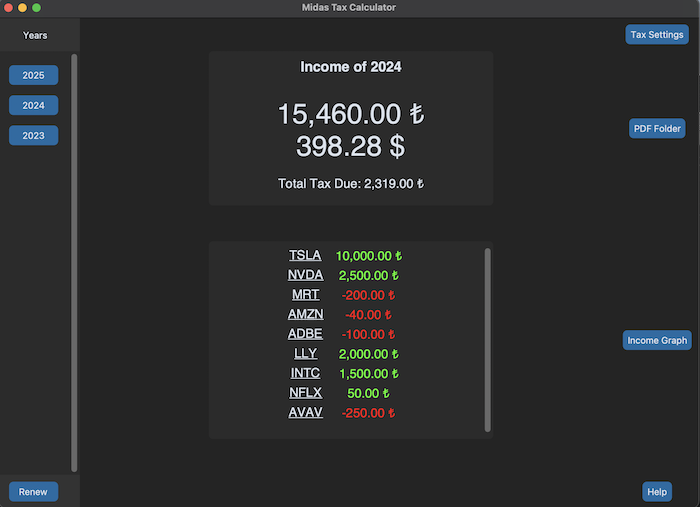
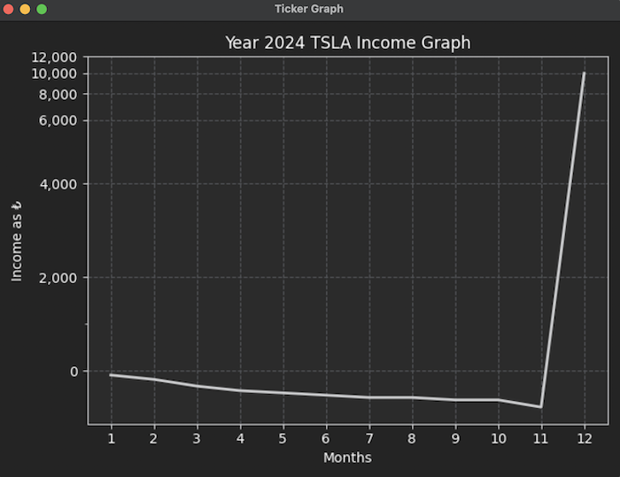

# Midas Tax Calculator


A Python-based utility that helps users calculate their capital gains tax based on transaction data exported from the **Midas** investment app.

## Screenshots





## Features

- View income and tax summaries for a selected year
- Display monthly graph of annual income and individual ticker performance
- Monitor income from open (alive) orders
- Fast and efficient performance

## Compatibility
Tested on macOS Ventura. Support for other platforms will be added in the future.

## Install & Setup
To install the project, run the following command in a terminal in your desired directory:

```bash
git clone https://github.com/OzanBtw/midas-tax-calc.git
cd midas-tax-calc
pip install -r requirements.txt
```

To run the project,
```bash
python main.py
```

To setup the project, you will need:

- An **EVDS API key**. Visit the [EVDS website](https://evds2.tcmb.gov.tr/) and log in to generate your API key.
- Monthly account extracts (in PDF) from the **Midas** app. Download all monthly extracts from the Midas app and place them in `source/extracts/pdf/` relative to the project root. 

After running the app for the first time, you will be prompted to enter and provide these.

> [!WARNING]
> All extracts must be included. Missing files may cause incorrect tax calculations or app crashes.

## License

Midas Tax Calculator is licensed under the Apache License, Version 2.0, as found in the [LICENSE](https://github.com/OzanBtw/midas-tax-calc/blob/main/LICENSE) file.


## FAQ

### How does the app calculate tax?
The app uses the **FIFO (First-In, First-Out)** method to match buy and sell orders and calculate capital gains. Fees from the transactions are included in the calculation.

### Does it include dividends or foreign income?
No — the current version only calculates taxes based on capital gains from **stock transactions**.


### Is this tool affiliated with Midas?
No. This is an **independent** open-source project. It is not affiliated with or endorsed by Midas.


### What happens if I forget to add an extract?
Missing extracts can lead to:
- Incomplete income calculations
- Crashes when resolving trades.

> [!IMPORTANT]
> The tax calculations provided by this tool are <mark>**for informational purposes only**</mark>. Users are solely responsible for any decisions or consequences that result from using this data for official tax filings.
